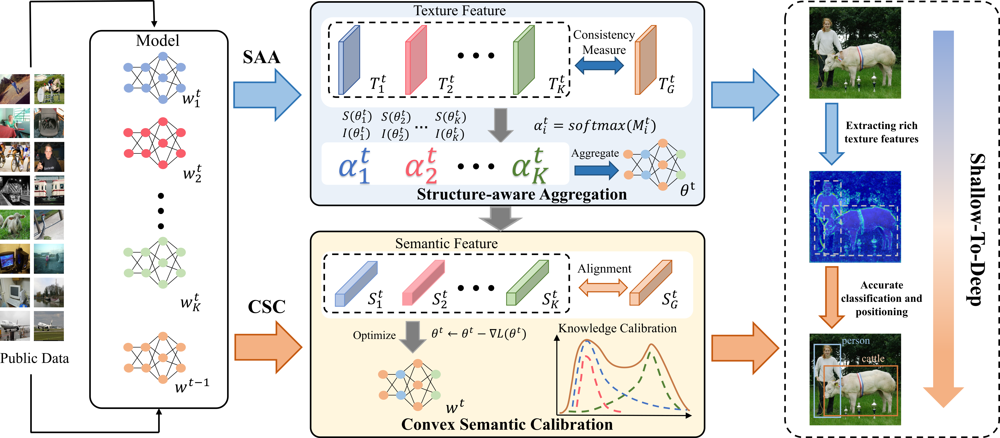

# Adaptive Hierarchical Aggregation for Federated Object Detection
Our [paper](https://openreview.net/forum?id=opVCEvRsTM) was accpeted by ACM Multimedia 2024.
## Overview

## Citation
```
@inproceedings{
jia2024adaptive,
title={Adaptive Hierarchical Aggregation for Federated Object Detection},
author={Ruofan Jia and Weiying Xie and Jie Lei and Yunsong Li},
booktitle={ACM Multimedia 2024},
year={2024},
url={https://openreview.net/forum?id=opVCEvRsTM}
}
```
## Requirements
* pytorch
* ultralytics
## Acknowledgement
Our code is built on Ultralytics' [YOLOv5](https://github.com/ultralytics/yolov5) and [RT-DETR](https://docs.ultralytics.com/models/rtdetr/).
